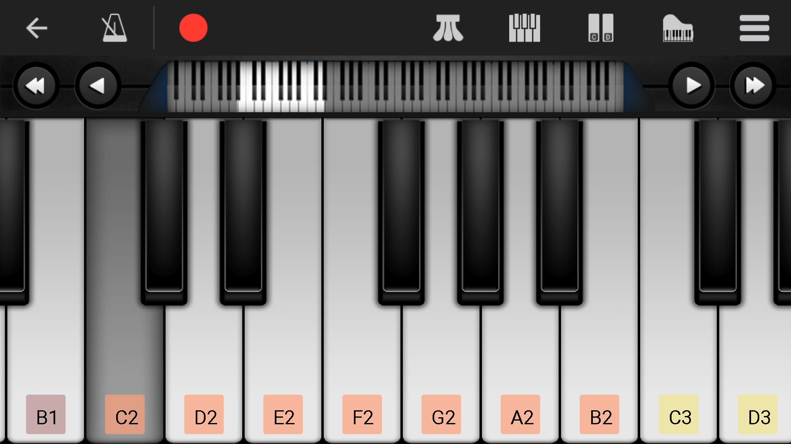

# 钢琴的88个键的声音样本

  

Tags: #PianoSound #SoundSample #Keyboard 

这里记录钢琴的88个键的独立声音样本，并将其和相应的五线谱和琴键联系起来。

为了钢琴的学习和音调的记忆，我收集了88个键的声音样本。这些样本是给那些缺乏音感，想要提高调辨识度的人；有的人总是依赖曲谱，离开曲谱就无法演奏；有的人，想要靠声音辨别音调。这些样本可以让你脱离钢琴，脱离一个人不好盲识键音的困扰。

如果你想像我一样想要提高自己的听力计巧，想要将琴音和各键，各音符联系起来，而不是一个只会看谱的弹琴机械，这些就是为你准备的。

为了方便记忆，我把这里的键音样本，五线谱和琴键做成了Anki卡片。如果你熟悉Anki的使用方式，你可以直接导入到你的Anki仓库里。如果你不熟悉，那我推荐你尝试使用Anki，这是一个不错的记忆软件。你可以到它的官网下载[Anki](https://apps.ankiweb.net/)，同样的我还推荐你看看这里的教程，我就是因为这里的教程才走上使用Anki的路的:[leananki](https://leananki.com/)

如果有帮到你，记得给个星星。如果你发现了任何错误，可以commit issus。谢谢。

## 下载声音样本

所有的声音样本都在文件夹[sound keyboard staff](https://github.com/Leethring/piano_88_key_sound_sample/tree/master/sound_keyboard_staff)里，你可以点击`Download`进行下载。

## 命名规则

为了省时间，我简化了文件的命名方式。

所有样本文件的命名是基于以下这张图片。

每一个琴键都和以下字符按顺序相关联:
A_2 B_2 C_1 D_1 E_1 F_1 G_1 A_1 B_1 C D E F G A B c d e f g a b c^1 d^1 e^1 f^1 g^1 a^1 b^1 c^2 d^2 e^2 f^2 g^2 a^2 b^2 c^3 d^3 e^3 f^3 g^3 a^3 b^3 c^4 d^4 e^4 f^4 g^4 a^4 b^4 c^5                         

在正常的情况下，文件的名字和键名差不多，除了个别：
1. 因为在windows下，大写文件名和小写文件名相同是被认为是同一文件夹的，所以我将只有一个字母的文件，比如"a"。命名为了"aa"。
2. 你会发现图片上有重叠的地方，我也将这里的音符记录下来了，并将高音区部分的命名多加了一个"high"。
3. 在"b"键之后，我的命名省略了`^`，从而文件名只有字母和数字，如"a1"。
4. 你会发现`png`都以1结尾，那是软件自己加的，没有什么特别的意义。

### 文件名结尾中的's'和'f'是什么意思

s代表升调，f代表降调。

因为我把每个有让升调，降调的音都录下来了，所以音频不止88个。

## 不同文件类型的用处

`mp3`文件是声音样本。是由MuseScore制谱软件产生的

`png`文件是相关的五线谱。同样由MuseScore产生

`jpg`文件是相关的琴键。是我从应用Perfect Piano上截的图。共有88个文件，对应88个琴键。黑键弹的时候，不够明显，你可以通过反光辨别。

`mscz`文件是MuseScore自己的数据文件，我们的`mp3`和`png`都是从这里生成的。

## Anki记忆卡片

我制做了大约400张卡片，共有4类问题：
1. 给你五线谱，回答音调（心里哼出来）
2. 给你琴键，回答音调
3. 给你键音样本，回答五线谱位置
4. 给你键音样本并伴随一个k字母，回答琴键位置

## 捐赠

如果有帮到你，你可以请我喝杯奶茶。

支付宝和微信：          

 

## Copyright

可以转载，转载请注明出处。我相信来GitHub的人都是有版权意识的。正因为是开源，大家才更乐意分享。
