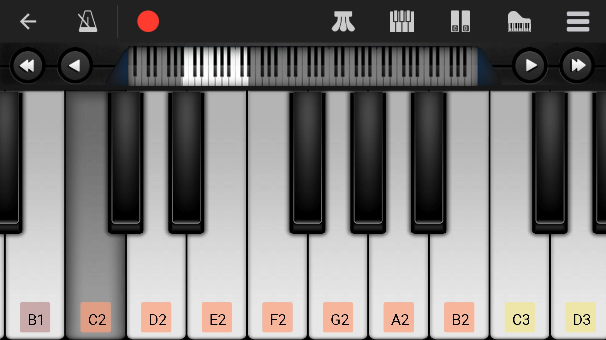
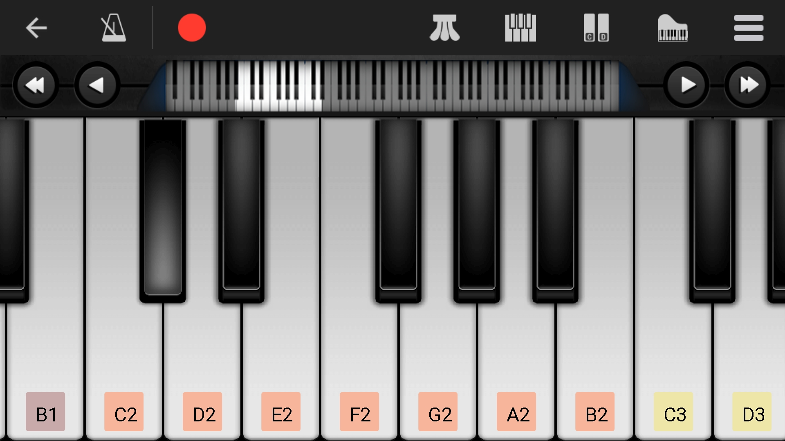
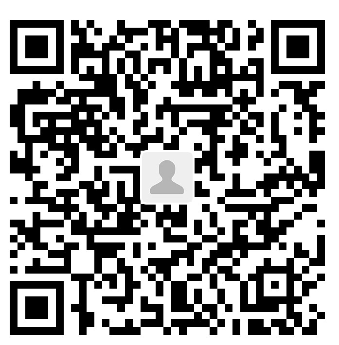

# ピアノの88鍵音サンプル

   

Tags: #Piano #Soundsample

（日本語はわかるが書けない。この記事はgoogleで翻訳されているので、エラーがあれば、僕に伝えてください）。

ここでは、ピアノの88キーの独立サウンドサンプルを録音し、それらを対応する譜表とキーにリンクします。

ピアノの学習と音色の記憶のために、88の主要なサウンドサンプル収集しました。これらのサンプルは、音の感覚に欠けており、キー認識を改善したい人向けです。これらのサンプルは、ピアノをなくし、盲目的に鍵音を知らない人の問題を取り除くことができます。

記憶を容易にするために、キートーンのサンプル、譜表、およびキーをAnkiカードに入れました。Ankiの使い方になれたいる場合は、Ankiの倉庫に直接いんインポートできます。慣れでいない場合は、優れたメモリソフトウェアであるAnkiを試してみることをお勧めします。
[Anki](https://apps.ankiweb.net/)は公式サイトからダウンロードできます。
[leananki](https://leananki.com/)このサイトはAnkiの使い方の学習はてきます。

それがあなたを助けるなら、星を与えることを忘れないでください。エラーが見つかった場合は、問題をコミットでください。ありがとうございました。

## サウンドサンプルをダウンロードする

すべでのサウンドサンプルは[sound keyboard staff](https://github.com/Leethring/piano_88_key_sound_sample/tree/master/sound_keyboard_staff)フォルダーにあります。`Download`おクリックしてダウンロードできます。

## 命名規則

時間を節約するために、ファイルの命名方法を簡略化しました。

全てのサンプルファイルは、次の図に基づいて名前が付けられています。

各キーは、次の文字に順番に関連つけられています。
A_2 B_2 C_1 D_1 E_1 F_1 G_1 A_1 B_1 C D E F G A B c d e f g a b c^1 d^1 e^1 f^1 g^1 a^1 b^1 c^2 d^2 e^2 f^2 g^2 a^2 b^2 c^3 d^3 e^3 f^3 g^3 a^3 b^3 c^4 d^4 e^4 f^4 g^4 a^4 b^4 c^5                         

通常の状況では、ファイル目は一部を除いてキー名に似ています。
1. Windowsでは、大文字のファイル名と小文字のファイル名は同じフォルダーとみなされるため、"a"などの"aa"を変える。
2. この図の重なっている部分は、"high"追加しました。
3. "b"キーの後は、名前の`^`を省略しているため、ファイル名には「a1」のように文字と数字しかありません。
4. `png`は宇部て1で終わることが見える。これはソファとウェア自体によって追加され、特別な意味はありません。

### ファイル名の最後にある「s」と「f」はどういう意味ですか

sはsharp、fはflat。ブラックキーの意味

## 様々なファイルライプの用意

`mp3`ファイルはサウンドサンプルです。MuseScoreソフトウェアによって作成されます

`png`ファイルは関連する五線です。同じ、MuseScoreによっても生成しました。

`jpg`ファイルは関連するキーです。これは、Perfect Pianoアプリケーションから撮った写真です。合計88個のファイルがあり、88課のキーに対応しています。黒い鍵盤を弾くと、はっきりしないので、光の反射で区別してください。

`mscz`ファイルはMuseScore自身のデータファイルで、`mp3`と`png`ここから生成されます。

## Ankiメモリーカード

私は4種類の質問で約400枚のカードを作成しました。
1. 五線を提供し、鍵音に答えます
2. キーを提供し、鍵音に答えます
3. 鍵音に提供し、五線に答えます
4. 鍵音を提供し、キーに答えます

## 寄付

AlipayとWeChat:

 