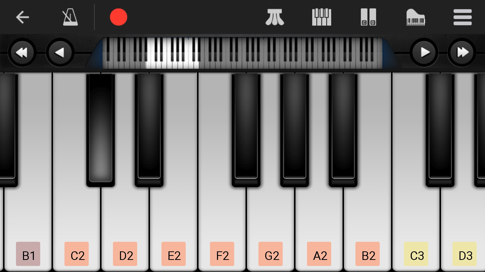

# piano_88_key_sound_sample

A collection of piano 88 key sound samples with its related staff and keyboard.

For piano learning and memory, I collect all piano sound samples. This repository is for someone who finds himself (or herself) lacking music sensitivity, always relies on the piano staff, and plays keyboard with staff, not music&mdash;em...I mean myself, hahaha.

If you like me to want to improve your piano listening skill and want to link the sound to the key or the stall, this repository is for. Also, if you just need these sound databases, you can directly download them. 

For memory, I have created an Anki deck package, if you are familiar with Anki, just use it. If you are not familiar with Anki, I recommend it for you, it's really a good tool for memory. Here is its website, you can download it from the web [Anki](https://apps.ankiweb.net/). I also provide a useful tutorial web: [leananki](https://leananki.com/) 

If this repository helped you, please star it. If you find some missed key, or mistake, please let me know it, or commit it directly, think you.

## Name rule

When you find the mp3 file, you may feel WTF. For the simplicty of creating, I simplify the name fo file. Below I will explain it.

The name is base on this picture:

Every key relates a name with a sequence:
A_2 B_2 C_1 D_1 E_1 F_1 G_1 A_1 B_1 C D E F G A B c d e f g a b c^1 d^1 e^1 f^1 g^1 a^1 b^1 c^2 d^2 e^2 f^2 g^2 a^2 b^2 c^3 d^3 e^3 f^3 g^3 a^3 b^3 c^4 d^4 e^4 f^4 g^4 a^4 b^4 c^5                         

In the normal situation, the file name is the same as the key name but not every. 
1. Because file with the uppercase letter is the same as lowercase, so when I name a file with a lowercase letter only, like 'a', I name it with 'aa'.
2. You can find there is an overlapping area, I also record it, the G clef part file name will add 'high'.
3. After b key, I neglect the superscript, name the file with character and number, like 'a1'
4. You will find the *png* file name ending with 1. This was added by the music program automatically.

### What are the 's' and 'f' at the end of the file name?

The 's' means 'sharp', 'f' means 'flat', if you learn the piano, I know you will know what it is.

Because I record every key with its going up (or down) a half step, so there are not only 88 sound samples.

## File type content

**mp3** file is sound. It was generated by *MuseScore*
**png** file is the sound-related staff. It also was generated by *MuseScore*

**jpg** file is the sound-related key. It is a screenshot from an app *Perfect Piano*. There are 88 jpg files relating to exactly 88 piano keys. The black is not so clear, you can find the difference by observing the light reflection.

**mscz** file is the *MuseScore* original data file. The **png** file and **mp3** file are exported from it.

## Anki Card

There are about 400 cards. We have 4 types of questions. 
1. Give you a staff, answer the related sound. (Obviously, we can't speak out some of them, we can sing it in our brain.)
2. Give you a key, answer the related sound.
3. Give you a sound, answer the related staff.
4. Give you a sound with a character 'k', which means 'keyboard', answer the related key.

## Donation

This is my "first" repository with some useful usage, I know it's imperfect. If you like, you can donate me 1 penny, or 0.1 pence, or 0.01 pence...

Alipay and Wechat:
 